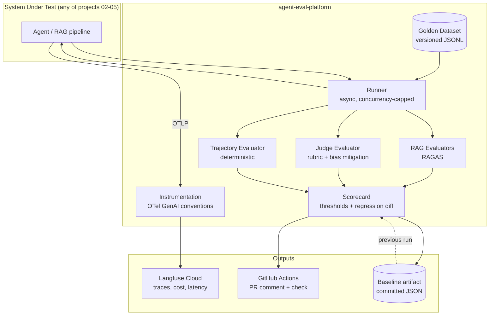

# CLAUDE.md — agent-eval-platform

## What this is
Reusable evaluation and observability platform for LLM-based systems. It is the
shared dependency of four other portfolio projects (azure-architecture-doc-agent,
iac-review-agent, agent-landing-zone, agent-red-team-lab).

## Owner context
Owner: Mario Vicente (github.com/marvicqui). Cloud Solutions Architect, 20+ years,
Azure-deep, pivoting to AI/Agentic Solutions Architect roles. Reads and reasons about
Python fluently but writes code with AI assistance — **optimise all code for
readability and explainability over cleverness**. Every module needs a docstring
explaining *why*, not *what*.

## Language rules
- Code, comments, commits, docs, README: **English**
- Conversation with the owner: **Spanish**

## Non-negotiables
1. Never commit secrets. This repo is public.
2. `DefaultAzureCredential` only — no Azure OpenAI API keys anywhere.
3. Every evaluator must be explainable in an interview. If a design choice is not
   defensible out loud, it is the wrong choice.
4. Instrumentation uses OpenTelemetry GenAI semantic conventions, never a vendor SDK.
5. Thresholds live in `evals/thresholds.yaml`, never hardcoded.
6. Deterministic checks (trajectory) outrank LLM-based ones. `forbidden_tool_calls > 0`
   is a hard failure regardless of other scores.

## Architecture

## Key commands
| Command | What it does |
|---|---|
| `make preflight` | Verify CLI tools, auth, Foundry deployments, Langfuse keys |
| `make install` | `uv sync` |
| `make test` | Unit tests, no LLM calls |
| `make eval` | Full eval run against the golden dataset |
| `make calibrate` | Judge vs human correlation report |
| `make report` | Markdown scorecard |
| `make teardown` | Delete the Azure resource group (`rg-aep-dev-eus2` only; shared Foundry survives) |

## Environment variables
See `.env.example`. Never commit `.env`.

## Current state
Phase: 6 of 6 — code and docs complete; two owner actions remain (below).
- CI gate LIVE and demonstrated: PR #1 (merged) shows the full story — a
  plausible one-line prompt change made the eval check fail (faithfulness
  regression 0.861 vs 0.934 baseline; judge_overall 0.661 < 0.70 floor and
  -0.207 vs baseline; verbosity_correlation jumped to 0.476), the revert
  commit turned the same gate green. Scorecard comments are on the PR.
- OIDC: app gha-agent-eval-platform, role = Cognitive Services OpenAI User
  on the Foundry resource only. GOTCHA: GitHub now presents immutable-ID
  subjects (repo:marvicqui@43182035/agent-eval-platform@1322565653:...) —
  federated credentials exist for BOTH formats; if azure/login breaks with
  AADSTS700213, check the presented subject in the error first.
- gitleaks in CI needs fetch-depth: 0 (commit-range scan).
- Infra deployed (rg-aep-dev-eus2: Log Analytics 1GB/day cap + App
  Insights); `make teardown` verified end-to-end and infra re-deployed.
- README carries the measured results; docs/img/architecture.svg exported.
Remaining owner actions:
1. Hand-annotate 20 cases: evals/calibration/annotation_sheet.md is ready;
   fill human_labels.template.jsonl scores (1-5), save as
   human_labels.jsonl, run `aep calibrate`, commit report.md, and paste the
   Spearman number into the README calibration paragraph.
2. Langfuse: rename project "My Project" -> agent-eval-platform; screenshot
   a trace + the PR #1 red check for README/docs/img.

Phase 4 notes (scorecard + thresholds + calibration tooling):
- `aep run` now evaluates (trajectory + judge + RAG) and stores scores;
  `aep report` renders the scorecard, applies the gate (exit 1 on fail) and
  can --update-baseline; `aep calibrate --make-template` generated the
  20-case annotation sheet in evals/calibration/ (WAITING ON MARIO's
  hand-scores as human_labels.jsonl before `aep calibrate` can run).
- Real measured baselines committed (evals/baseline.json): faithfulness
  0.934, answer_relevancy 0.757, context_precision 1.0, context_recall
  0.852, judge_overall 0.868, position_flip_rate 0.267 (monitor, honest,
  diagnosed in docs/metrics.md), verbosity_correlation 0.269. agent_tasks:
  tool_precision/recall 1.0, forbidden 0.
- answer_relevancy threshold calibrated 0.80→0.70 from real data — the
  reasoning is in evals/thresholds.yaml and docs/metrics.md; do not revert
  without re-reading it.
- Full evaluated run: ~26 min wall at concurrency 4, ~$0.03 SUT cost/run.
Next: Phase 5 — CI gate (ci.yml + eval.yml already drafted in
.github/workflows/), OIDC app federation for this repo, repo
variables/secrets, then the demo PR that degrades a prompt to show the gate
red, and its fix. ADR-0004.

Phase 3 notes (evaluators):
- Trajectory oracle (deterministic, LLM-free): precision/recall, forbidden
  calls (hard fail), loop detection, ordering checks — 39 tests pass.
- JudgeEvaluator: YAML rubric, JSON validated with pydantic (1 retry then
  judge_error), overall computed as weighted sum in code. Bias mitigations
  implemented AND measured: both-orders pairwise (position_flip metric),
  answer_length + verbosity_correlation(), self-preference guard
  (AEP_ALLOW_SAME_JUDGE=1 currently active — documented limitation until
  gpt-large quota arrives).
- RagEvaluator over ragas 0.4.3 collections API. Gotchas solved: langchain
  pinned <1 (ragas imports langchain_community 0.3); a Foundry deployment
  literally named `gpt-5-mini` exists because ragas detects reasoning models
  by NAME to map max_tokens->max_completion_tokens while Azure routes by
  deployment name; max_tokens=8192 (reasoning eats completion budget).
- Live smoke test on a real case: judge_overall 0.825, faithfulness 0.8,
  answer_relevancy 0.70, context_precision ~1.0, context_recall 0.75.
- docs/judge-failure-modes.md + ADR-0003 written.
Next: Phase 4 — scorecard (aggregate/thresholds/report), thresholds.yaml
calibrated from real runs, baseline.json, `aep calibrate` (Spearman + kappa
vs Mario's 20 hand-annotated cases in evals/calibration/human_labels.jsonl —
NEEDS MARIO), docs/metrics.md.
Pending owner action: rename the Langfuse project ("My Project" →
agent-eval-platform); screenshot for README (phase 6); annotate 20 cases for
calibration (phase 4).

## Decisions already made (do not relitigate)
- Azure OpenAI / Microsoft Foundry as the only model provider in v1
- Langfuse Cloud free tier, reached via OTLP
- Golden dataset in git as JSONL, not in a database
- Golden dataset domain: **Azure Well-Architected / CAF Q&A** (owner's choice, reusable by projects 02–03)
- Corpus for `examples/minimal_sut.py`: public Microsoft Learn (CAF/WAF) excerpts with source attribution — owner opted not to use private docs
- Python 3.12 with uv
- Bicep for infra
- Model deployments on shared Foundry `foundry-marvicqui-dev` (rg-shared-dev-eus2):
  `gpt-small` = gpt-5-mini (gpt-4o-mini is Deprecating in Azure and rejects new
  deployments), `embeddings` = text-embedding-3-small. `gpt-large` is NOT deployed
  yet (quota 0 in eastus2, increase requested) — until it exists, judge model ==
  SUT model, which must be surfaced as a known self-preference limitation, not hidden.
See `docs/adr/` for the reasoning.

## Open questions for the owner
- (none right now — ask before inventing any architectural decision)
