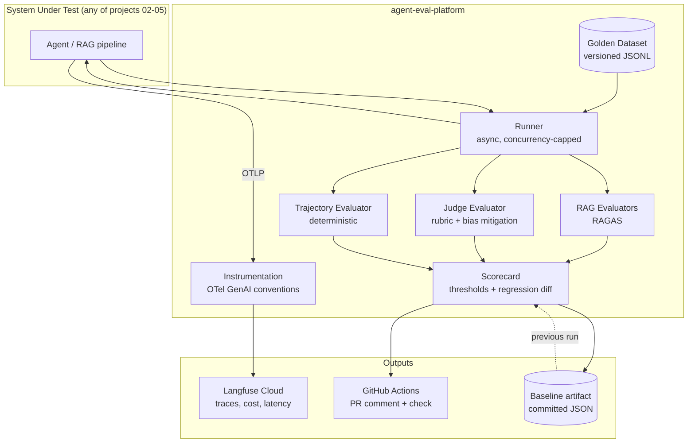

# CLAUDE.md — agent-eval-platform

## What this is
Reusable evaluation and observability platform for LLM-based systems. It is the
shared dependency of four other portfolio projects (azure-architecture-doc-agent,
iac-review-agent, agent-landing-zone, agent-red-team-lab).

## Owner context
Owner: Mario Vicente (github.com/marvicqui). Cloud Solutions Architect, 20+ years,
Azure-deep, pivoting to AI/Agentic Solutions Architect roles. Reads and reasons about
Python fluently but writes code with AI assistance — **optimise all code for
readability and explainability over cleverness**. Every module needs a docstring
explaining *why*, not *what*.

## Language rules
- Code, comments, commits, docs, README: **English**
- Conversation with the owner: **Spanish**

## Non-negotiables
1. Never commit secrets. This repo is public.
2. `DefaultAzureCredential` only — no Azure OpenAI API keys anywhere.
3. Every evaluator must be explainable in an interview. If a design choice is not
   defensible out loud, it is the wrong choice.
4. Instrumentation uses OpenTelemetry GenAI semantic conventions, never a vendor SDK.
5. Thresholds live in `evals/thresholds.yaml`, never hardcoded.
6. Deterministic checks (trajectory) outrank LLM-based ones. `forbidden_tool_calls > 0`
   is a hard failure regardless of other scores.

## Architecture

## Key commands
| Command | What it does |
|---|---|
| `make preflight` | Verify CLI tools, auth, Foundry deployments, Langfuse keys |
| `make install` | `uv sync` |
| `make test` | Unit tests, no LLM calls |
| `make eval` | Full eval run against the golden dataset |
| `make calibrate` | Judge vs human correlation report |
| `make report` | Markdown scorecard |
| `make teardown` | Delete the Azure resource group (`rg-aep-dev-eus2` only; shared Foundry survives) |

## Environment variables
See `.env.example`. Never commit `.env`.

## Current state
Phase: 1 of 6 completed (instrumentation). `uv run python examples/minimal_sut.py`
runs end-to-end (Entra auth, gpt-5-mini) and traces land in Langfuse Cloud with
tokens and computed cost per request (verified via Langfuse API: invoke_agent
traces with 4 observations, totalCost populated). ADR-0001 written.
Next: Phase 2 — golden dataset (30+ Azure WAF/CAF cases, 3 difficulty levels)
and the async runner + SystemUnderTest protocol. Acceptance: `aep run` executes
all cases with capped concurrency and emits per-case JSON results.
Pending owner action: rename the Langfuse project ("My Project" →
agent-eval-platform) and screenshot a trace for the README (phase 6).

## Decisions already made (do not relitigate)
- Azure OpenAI / Microsoft Foundry as the only model provider in v1
- Langfuse Cloud free tier, reached via OTLP
- Golden dataset in git as JSONL, not in a database
- Golden dataset domain: **Azure Well-Architected / CAF Q&A** (owner's choice, reusable by projects 02–03)
- Corpus for `examples/minimal_sut.py`: public Microsoft Learn (CAF/WAF) excerpts with source attribution — owner opted not to use private docs
- Python 3.12 with uv
- Bicep for infra
- Model deployments on shared Foundry `foundry-marvicqui-dev` (rg-shared-dev-eus2):
  `gpt-small` = gpt-5-mini (gpt-4o-mini is Deprecating in Azure and rejects new
  deployments), `embeddings` = text-embedding-3-small. `gpt-large` is NOT deployed
  yet (quota 0 in eastus2, increase requested) — until it exists, judge model ==
  SUT model, which must be surfaced as a known self-preference limitation, not hidden.
See `docs/adr/` for the reasoning.

## Open questions for the owner
- (none right now — ask before inventing any architectural decision)
