# agent-eval-platform

**Evaluation and observability platform for LLM-based systems** — golden datasets, LLM-as-Judge with *measured* bias mitigation, a deterministic trajectory oracle, OpenTelemetry GenAI tracing, and a CI gate that blocks merges when quality regresses.

Built as the shared quality infrastructure for a five-project agentic-AI portfolio; every number below is measured by this codebase, not illustrated.

## The problem

Gartner projects that over 40% of agentic AI projects will be canceled by end of 2027. MIT NANDA documented that 95% of corporate GenAI pilots delivered no measurable return. The dominant root cause is not model capability — it is the absence of robust evaluation: teams ship agents they cannot test, so they cannot see regressions, costs, or failure modes until production does it for them. This platform treats LLM evaluation as *quality engineering with an oracle*, not as an ML-metrics afterthought.

## What this does

- **Golden dataset in git** (30 Azure Well-Architected/CAF cases, 3 difficulty tiers) — ground truth changes are PR diffs, never silent drift
- **Three evaluation layers with explicit precedence**: deterministic trajectory oracle (which tools ran; forbidden calls are a hard fail) → RAG metrics (RAGAS) → LLM-as-Judge with an explicit rubric
- **The judge is not trusted blindly**: position bias, verbosity bias and self-preference are mitigated in code *and measured every run*; the judge is calibrated against the owner's hand annotations (Spearman + weighted Cohen's kappa)
- **OpenTelemetry GenAI tracing** to Langfuse over plain OTLP — cost and latency per request computed client-side, no vendor SDK (ADR-0001)
- **A CI quality gate**: every PR runs the full eval, gets a scorecard comment, and the check fails on absolute-threshold breaks or regressions vs the committed baseline

## Architecture

```mermaid
flowchart TB
    subgraph SUT["System Under Test"]
        A[Agent / RAG pipeline]
    end

    subgraph AEP["agent-eval-platform"]
        direction TB
        I[Instrumentation<br/>OTel GenAI conventions]
        D[(Golden Dataset<br/>versioned JSONL)]
        R[Runner<br/>async, concurrency-capped]
        E1[RAG Evaluators<br/>RAGAS]
        E2[Judge Evaluator<br/>rubric + bias mitigation]
        E3[Trajectory Evaluator<br/>deterministic]
        S[Scorecard<br/>thresholds + regression diff]
    end

    subgraph OUT["Outputs"]
        LF[Langfuse Cloud<br/>traces, cost, latency]
        GH[GitHub Actions<br/>PR comment + check]
        AR[(Baseline artifact<br/>committed JSON)]
    end

    A -->|OTLP| I --> LF
    D --> R --> A
    A --> R
    R --> E1 & E2 & E3 --> S
    S --> GH
    S --> AR
    AR -.->|previous run| S
```



## Results (measured, not illustrative)

First full evaluated run — 30-case golden dataset, gpt-5-mini for SUT, judge and RAGAS evaluators, 2026-08-04 (`evals/baseline.json`):

| Metric | Value | Threshold |
|---|---:|---:|
| faithfulness | **0.934** | ≥ 0.85 |
| answer_relevancy | 0.757 | ≥ 0.70 (calibrated — see below) |
| context_precision | 1.000 | ≥ 0.70 |
| context_recall | 0.852 | ≥ 0.70 |
| judge_overall (rubric, 0–1) | 0.868 | ≥ 0.70 |
| tool_precision / tool_recall (agent tasks) | 1.0 / 1.0 | reported |
| forbidden_tool_calls | **0** | hard fail if > 0 |
| **Cost per full 30-case SUT run** | **$0.029** | — |
| Wall clock (SUT / with evaluation) | 132 s / 26 min | concurrency 4 |

Judge bias monitors, measured on the same run:

| Monitor | Value | Target |
|---|---:|---:|
| position_flip_rate | 0.267 | < 0.10 |
| verbosity_correlation (Pearson) | 0.269 | \|r\| < 0.30 |

That `position_flip_rate` is over target, and it is reported anyway: with the judge running on the *same model* as the SUT (single-deployment quota limitation, documented) and pairwise comparisons against terse references, near-ties concentrate flips. The mitigation converts every flipped verdict into a tie instead of trusting it — the number is the mitigation working, not failing. Details and diagnosis: [`docs/metrics.md`](docs/metrics.md).

## The judge is not trusted blindly

Three documented failure modes, each mitigated in code and measured (full write-up: [`docs/judge-failure-modes.md`](docs/judge-failure-modes.md)):

| Bias | Mitigation | Evidence it works |
|---|---|---|
| Position | Every pairwise comparison runs in both orders; a flipped verdict counts as a tie | `position_flip_rate` reported per run; synthetic always-prefers-first judge caught by unit tests |
| Verbosity | Rubric scores coverage of enumerated required points, never length | `verbosity_correlation` 0.269, inside the \|r\| < 0.30 band |
| Self-preference | Building a judge on the SUT's own deployment raises an error unless explicitly overridden | Override currently active (one-model quota) — a visible config choice with a documented caveat, not a hidden default |

Calibration against human judgment (`aep calibrate`, Spearman + linearly-weighted Cohen's kappa over 20 hand-annotated cases) is the final trust check — annotation in progress; the report lands in `evals/calibration/report.md`.

## The quality gate

[PR #1](https://github.com/marvicqui/agent-eval-platform/pull/1) is the live demo: a one-line prompt change that a human reviewer would plausibly approve ("just making answers concise"), caught by the gate because faithfulness collapses and the judge score regresses vs the committed baseline. The follow-up commit reverts it and the same gate goes green.

The gate mechanics: absolute floors per metric plus a regression tolerance (0.05) against `evals/baseline.json`; `forbidden_tool_calls > 0` fails hard regardless of every other score; evaluator errors are missing data, never silently-passing zeros; a thresholded metric that produces no data fails the gate — silence never looks like passing.

## Quickstart

```bash
git clone https://github.com/marvicqui/agent-eval-platform && cd agent-eval-platform
cp .env.example .env      # fill in Langfuse keys and Azure resource names
make preflight            # verify CLIs, auth, model deployments, Langfuse keys
make install              # uv sync
make eval                 # full run: SUT + judge + RAG + trajectory -> evals/runs/latest.json
uv run aep report         # scorecard + gate (exit 1 on failure)
```

## Design decisions

- [ADR-0001](docs/adr/0001-opentelemetry-over-vendor-sdk.md) — OpenTelemetry GenAI conventions over the vendor SDK: migration cost asymmetry
- [ADR-0002](docs/adr/0002-dataset-in-git-not-database.md) — golden dataset in git: ground-truth changes must be PR-reviewable
- [ADR-0003](docs/adr/0003-llm-judge-plus-deterministic-oracles.md) — three evaluator layers; deterministic oracles outrank the judge
- [ADR-0004](docs/adr/0004-oidc-federation-over-ci-secrets.md) — OIDC federation, zero stored cloud secrets, least-privilege scope

## What this deliberately does not do

- **No UI** — Langfuse is the UI; building another one is undifferentiated work
- **No fine-tuning or training** — out of scope for an evaluation platform
- **One model provider (Azure OpenAI)** — the abstraction gets added when a second real need exists, not before
- **Not a generic eval framework** — it serves five concrete projects; generality is a cost until proven otherwise

## Cost

A full 30-case SUT run costs **$0.029**; evaluation (judge with both-orders pairwise + four RAGAS metrics) roughly triples the LLM traffic, keeping a complete gate run under **$0.15**. Azure-side infra is App Insights + Log Analytics with a 1 GB/day cap — under $5/month. Every span carries client-side computed cost (`aep.usage.cost_usd`); models missing from the price table are flagged `cost_unknown`, never priced $0.

## Security note

This is a public portfolio repository. CI authenticates to Azure via **OIDC federation** — no stored cloud secrets; the workflow identity holds exactly one role (`Cognitive Services OpenAI User`) on exactly one resource. `AZURE_SUBSCRIPTION_ID` / `AZURE_TENANT_ID` are GitHub Actions *variables* and are visible in logs: not cryptographic secrets, but reconnaissance information — acceptable and documented for a portfolio; **use encrypted secrets for this in production**. There are zero Azure OpenAI API keys anywhere in this project: local runs use `DefaultAzureCredential`, a gitleaks pre-commit hook plus CI scan guard the rest.

## License

MIT
