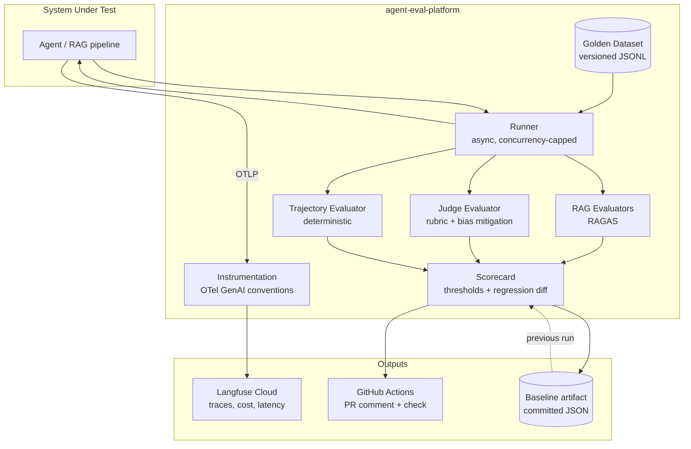

# agent-eval-platform

**Evaluation and observability platform for LLM-based systems** — golden datasets, LLM-as-Judge with *measured* bias mitigation, deterministic trajectory checks, OpenTelemetry GenAI tracing, and a CI gate that blocks merges when quality regresses.

> 🚧 **Status: Phase 0 of 6 (bootstrap).** This README will grow a real, measured results table as the project progresses — no example numbers, only numbers actually produced by this codebase.

## The problem

Gartner projects that over 40% of agentic AI projects will be canceled by end of 2027. MIT NANDA documented that 95% of corporate GenAI pilots delivered no measurable return. The most cited root cause is not model performance — it is the absence of robust evaluation systems. This platform treats LLM evaluation as a *quality-engineering-with-an-oracle* problem, not an ML-metrics problem.

## What this does

- **Golden dataset** versioned in git as JSONL — reviewable and diffable in PRs
- **Three evaluation layers**: RAG metrics (RAGAS), LLM-as-Judge with an explicit rubric, and a deterministic trajectory oracle over tool calls
- **The judge is not trusted blindly**: position bias, verbosity bias, and self-preference are mitigated *and measured*, and the judge is calibrated against human annotations (Spearman + Cohen's kappa)
- **OpenTelemetry tracing** with GenAI semantic conventions, exported to Langfuse Cloud — cost and latency per request, no vendor SDK
- **A CI quality gate**: every PR runs the evals, gets a scorecard comment, and the check fails on regression

## Architecture



## Quickstart

```bash
git clone https://github.com/marvicqui/agent-eval-platform && cd agent-eval-platform
cp .env.example .env        # fill in Langfuse keys and Azure resource names
make preflight              # verify CLIs, auth, model deployments, Langfuse keys
make install                # uv sync
make test                   # unit tests — no LLM calls
```

## Security note

This is a public portfolio repository. `AZURE_SUBSCRIPTION_ID` and `AZURE_TENANT_ID` are stored as GitHub Actions *variables* and are therefore visible in Actions logs. They are not cryptographic secrets, but they are reconnaissance information: acceptable for a portfolio, **use encrypted secrets if you clone this pattern for production**. There are zero Azure OpenAI API keys anywhere in this project — all Azure authentication is `DefaultAzureCredential` (Entra ID), and CI authenticates via OIDC federation with no stored credentials.

## License

MIT
